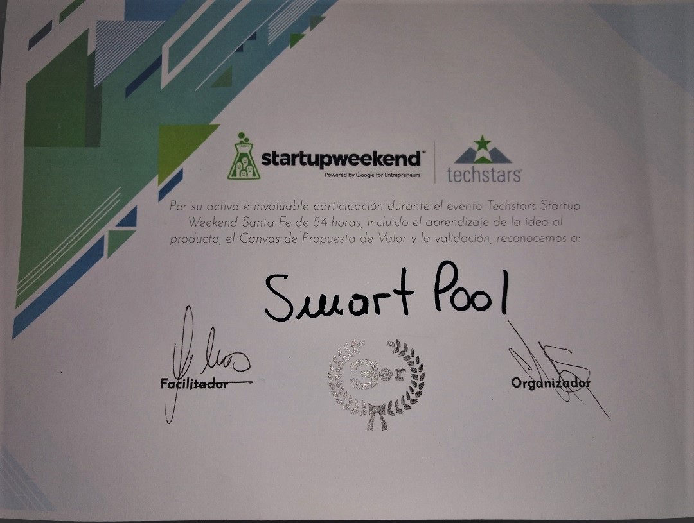

SmartPool es una solución integral para la dosificación de químicos en piscinas de manera óptima. 

El proyecto es un emprendimiento propio que consta de un dispositivo que realiza la dosificación y una app que visualiza los parámetros y el estado de la piscina. El proyecto consta por un lado de un dispositivo (RaspberryPi + Arduino) conectado a AWS IoT Core y por otro lado un backend desarrollado en Node.js con Serverless Framework sobre AWS Lambda y una PWA desarrollada en Angular desplegada en AWS S3. La base de datos utilizada para almacenar los datos sensados es AWS DynamoDB.  

El proyecto obtuvo un premio en una jornada Startup Weekend by Google Entrepreneurs desarrollada en la Santa Fe, Argentina.  

 
App Source: <a href="https://github.com/matiaszilli/appSP"><i class="large github icon"></i>matiaszilli/appSP</a>  
Serverless Backend Source: <a href="https://github.com/matiaszilli/backendSP"><i class="large github icon"></i>matiaszilli/backendSP</a>  
Raspberry and Arduino Source: <a href="https://github.com/matiaszilli/deviceSP"><i class="large github icon"></i>matiaszilli/deviceSP</a>