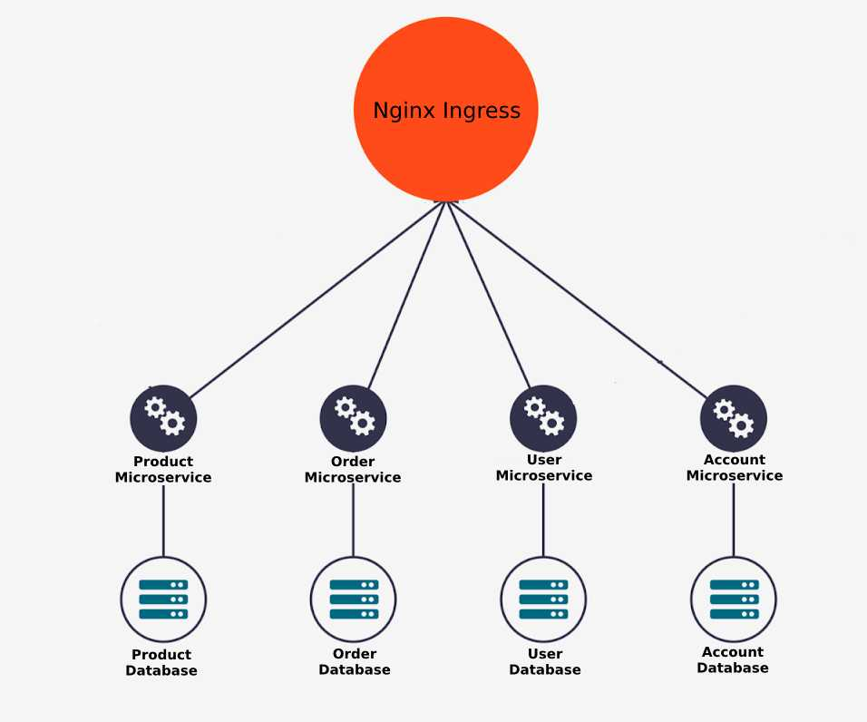

El proyecto consiste de un simple shopping cart desarrollado utilizando arquitectura de microservicios.

En total se desarrollaron 4 microservicios (order, account, user, product) utilizando Node.js, cada uno de estos está enlazado a su propia base de datos MongoDB Atlas.

El despliegue se hizo con Jenkins sobre un cluster de Kubernetes fully-managed sobre AWS (EKS), Kubernetes está configurado para realizar escalado automático (cluster_autoscaler) de los workers corriendo en un ASG de EC2. El api gateway se configuró con ingress-nginx controller corriendo sobre el mismo cluster de Kubernetes y soportado por un NLB.

Source: <a href="https://github.com/mzorg"><i class="large github icon "></i>mzorg</a>

