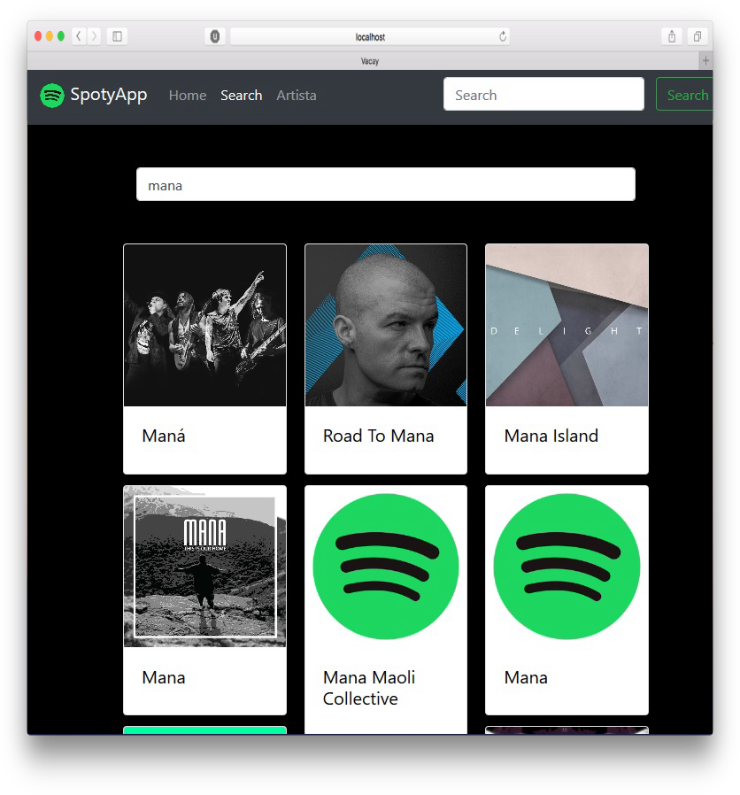
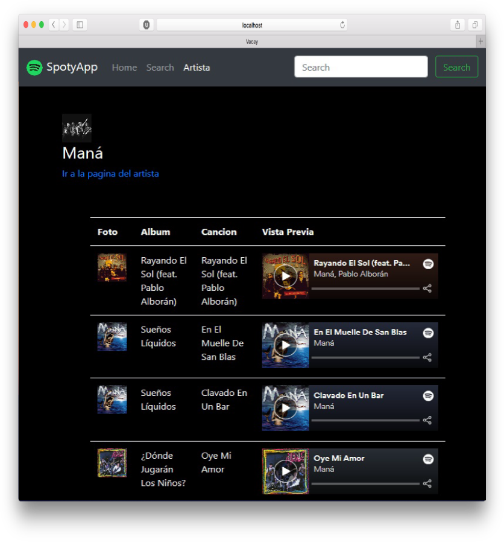
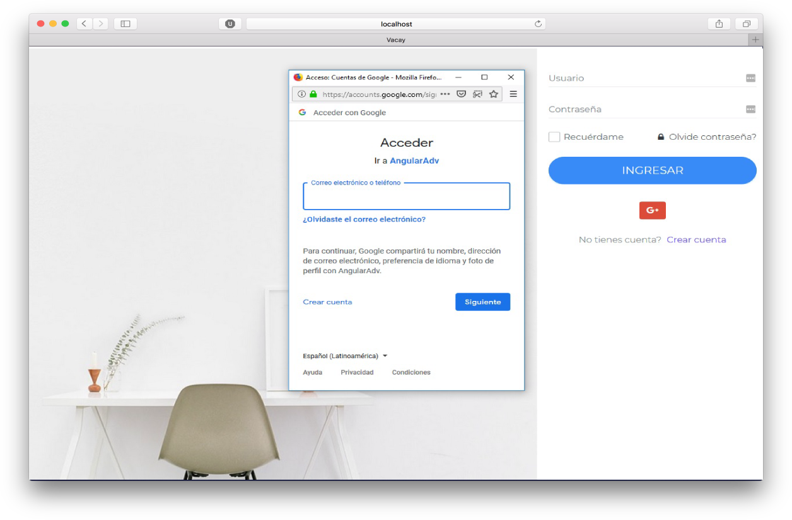
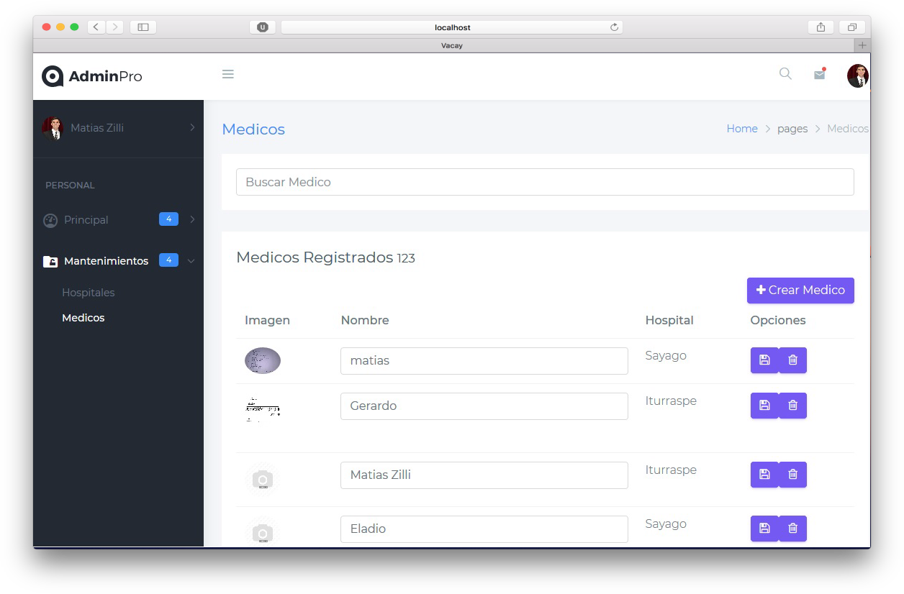
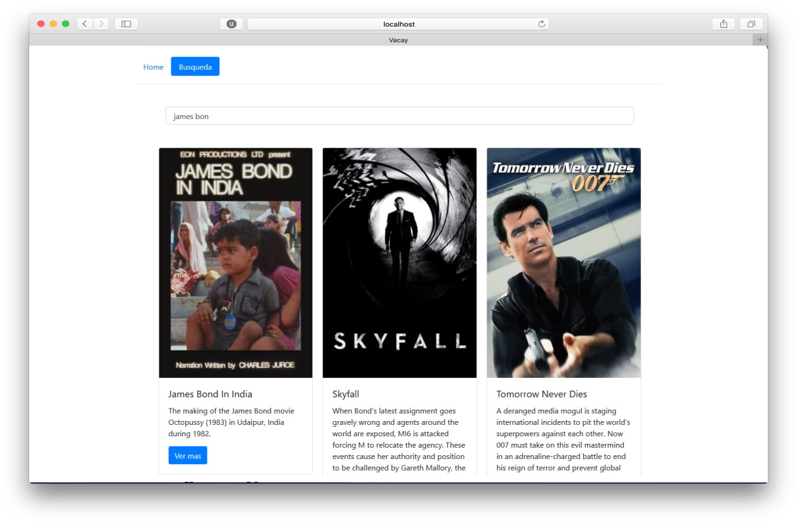
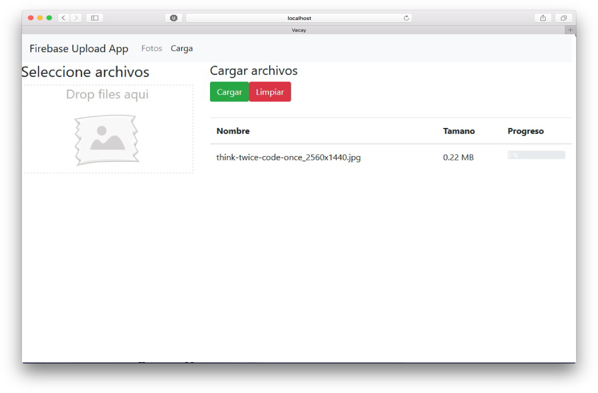

Estos son algunos ejemplos de apps desarrolladas mientras aprendía Angular 2.

Spotiapp es una app que utiliza la api de Spotify para obtener información de álbumes, artistas y tracks. Esta permite consultar los nuevos lanzamientos de álbumes, buscar artistas, consultar información de un artista dado incluyendo sus top-tracks y un preview de estos.

  
  

Clinicaapp es una app que utiliza un backend desarrollado en Node.js con base de datos MongoDB, esta permite administrar la gestión de una clínica incluyendo hospitales, médicos y usuarios, cada uno de estos con sus roles asociados, soporta login normal y mediante Google.

  
  

Peliculasapp es un simple desarrollo que utiliza la api "themoviedb.org" para obtener informacion de peliculas populares, películas para niños y nuevos lanzamientos. Además permite buscar películas por nombre y mostrar toda la información asociada a estas.

  

Fireapp es una simple app que permite subir imágenes a Firebase y visualizar estas, soporta drag and drop en el navegador además de mostrar un preview de la imagen y su progreso al hacer upload.

  

Source: <a href="https://github.com/matiaszilli/someAngular"><i class="large github icon "></i>matiaszilli/someAngular</a>

